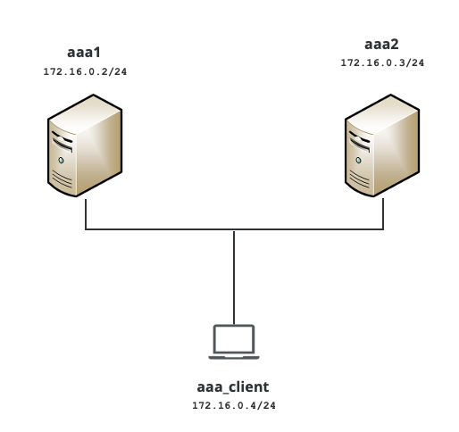

# Redundant Radius server example

The project creates 3 containers using the images created in the upper folder and arrange them as per the diagram shown below. The example sets up a network of 2 radius server and 1 client. 



A couple of useful scripts help creating, deleting and operating the container cluster. The created aaa_client can be used to test configurations. Due to the way the scripts are written only one cluster can be created and maintened per host.

The volumes folder keeps all configurations and scripts to automatically start and configure each container. The radius configuration files are kept outside of the containers. This allows to make changes persistent as well as reconfiguring freeradius without logging into the container. Since it is a set of redundant aaa servers, there is only one configuration file which gets read by both servers. If changes shall be tested on a single server, then the reload script allows to reload either a single or both servers.

The freeradius security scheme requires certain r/w and ownerships which will be set during the first compose. Hence it is required to use root privileges for changing the radius configuration or reading the log files. 

Following is a quick explanation of the scripts.
## Command Reference
- [Up](#up)
- [Configure](#configure)
- [Reload](#reload)
- [Connect](#connect)
- [Test](#test)
- [Show_log](#show_log)
- [Clean_up](#clean_up)
- [Down](#down)

### up 

The following example creates a container cluster and neworks. It configures all containers so that both aaa server can receive auth and acct traffic. The aaa_client is able to generate test traffic according to the configuration.
```
$ ./up 
Creating network "radius_rad_net" with driver "bridge"
Creating radius_aaa1_1       ... done
Creating radius_aaa_client_1 ... done
Creating radius_aaa2_1       ... done
$ 
```
[Back to command reference list](#command-reference)  

### configure
Allows to directly access the radius configuration files. The script accepts "users" or "clients" as input to configure either the "authorize" or "clients.conf" file. 
```
$ ./configure users

$ ./configure clients
```
[Back to command reference list](#command-reference)  

### reload
Allows to apply the changed configuration. It allows for the container name (or its short forms as per configure above) or "all" to reload all configurations in one shot. 
```
$ ./reload aaa1
$
$ ./reload aaa2
$
$ ./reload all
$
```
[Back to command reference list](#command-reference)  

### connect
Allow to ssh directly into the container. The default password "root" is applicable to all containers.
```
$ ./connect aaa1
Warning: Permanently added '[localhost]:55050' (ECDSA) to the list of known hosts.
root@localhost's password: 
Welcome to Alpine!

The Alpine Wiki contains a large amount of how-to guides and general
information about administrating Alpine systems.
See <http://wiki.alpinelinux.org/>.

You can setup the system with the command: setup-alpine

You may change this message by editing /etc/motd.

00f65e587c96:~# 
```
[Back to command reference list](#command-reference)  

### test
A script that allows to run a sequence of radius transactions towards each of the servers. It starts with an authentication message, followed by an accounting start and accounting stop.
```
./test
Sent Access-Request Id 101 from 0.0.0.0:58087 to 172.16.0.2:1812 length 53
        User-Name = "testing"
        User-Password = "password"
        NAS-IP-Address = 10.0.0.1
        Cleartext-Password = "password"
Received Access-Accept Id 101 from 172.16.0.2:1812 to 172.16.0.4:58087 length 20
Sent Accounting-Request Id 115 from 0.0.0.0:43576 to 172.16.0.2:1813 length 41
        Acct-Status-Type = Start
        Acct-Session-Id = "testing"
        NAS-IP-Address = 10.0.0.1
        Client-IP-Address = 192.168.0.1
        Acct-Unique-Session-Id = "123456789"
Received Accounting-Response Id 115 from 172.16.0.2:1813 to 172.16.0.4:43576 length 20
Sent Accounting-Request Id 123 from 0.0.0.0:44023 to 172.16.0.2:1813 length 41
        Acct-Status-Type = Stop
        Acct-Session-Id = "testing"
        NAS-IP-Address = 10.0.0.1
        Client-IP-Address = 192.168.0.1
        Acct-Unique-Session-Id = "123456789"
Received Accounting-Response Id 123 from 172.16.0.2:1813 to 172.16.0.4:44023 length 20
Sent Access-Request Id 141 from 0.0.0.0:57696 to 172.16.0.3:1812 length 53
        User-Name = "testing"
        User-Password = "password"
        NAS-IP-Address = 10.0.0.1
        Cleartext-Password = "password"
Received Access-Accept Id 141 from 172.16.0.3:1812 to 172.16.0.4:57696 length 20
Sent Accounting-Request Id 164 from 0.0.0.0:47730 to 172.16.0.3:1813 length 41
        Acct-Status-Type = Start
        Acct-Session-Id = "testing"
        NAS-IP-Address = 10.0.0.1
        Client-IP-Address = 192.168.0.1
        Acct-Unique-Session-Id = "123456789"
Received Accounting-Response Id 164 from 172.16.0.3:1813 to 172.16.0.4:47730 length 20
Sent Accounting-Request Id 114 from 0.0.0.0:59761 to 172.16.0.3:1813 length 41
        Acct-Status-Type = Stop
        Acct-Session-Id = "testing"
        NAS-IP-Address = 10.0.0.1
        Client-IP-Address = 192.168.0.1
        Acct-Unique-Session-Id = "123456789"
Received Accounting-Response Id 114 from 172.16.0.3:1813 to 172.16.0.4:59761 length 20
```
[Back to command reference list](#command-reference)  

### show_log
A script that allows to verify the log entries generated by the test script. It shows the last 100 lines of the log file.
```
$ ./show_log 
Wed Mar 30 15:01:20 2022
        Acct-Status-Type = Start
        Acct-Session-Id = "testing"
        NAS-IP-Address = 10.0.0.1
        Event-Timestamp = "Mar 30 2022 15:01:20 UTC"
        Tmp-String-9 = "ai:"
        Acct-Unique-Session-Id = "121b103507d8440564520b77b8413f29"
        Timestamp = 1648652480

Wed Mar 30 15:01:21 2022
        Acct-Status-Type = Stop
        Acct-Session-Id = "testing"
        NAS-IP-Address = 10.0.0.1
        Event-Timestamp = "Mar 30 2022 15:01:21 UTC"
        Tmp-String-9 = "ai:"
        Acct-Unique-Session-Id = "121b103507d8440564520b77b8413f29"
        Timestamp = 1648652481

Wed Mar 30 15:01:23 2022
        Acct-Status-Type = Start
        Acct-Session-Id = "testing"
        NAS-IP-Address = 10.0.0.1
        Event-Timestamp = "Mar 30 2022 15:01:23 UTC"
        Tmp-String-9 = "ai:"
        Acct-Unique-Session-Id = "121b103507d8440564520b77b8413f29"
        Timestamp = 1648652483

Wed Mar 30 15:01:24 2022
        Acct-Status-Type = Stop
        Acct-Session-Id = "testing"
        NAS-IP-Address = 10.0.0.1
        Event-Timestamp = "Mar 30 2022 15:01:24 UTC"
        Tmp-String-9 = "ai:"
        Acct-Unique-Session-Id = "121b103507d8440564520b77b8413f29"
        Timestamp = 1648652484
$
```
[Back to command reference list](#command-reference)  

### clean_up
Cleans up the script ownership and r/w privileges and allows for a clean restart using ./up. This is also require to update the git repo.
```
$ ./clean_up
```
[Back to command reference list](#command-reference)  

### down
Stops and removes the cluster and networks.
```
$ ./down
Stopping radius_aaa1_1       ... done
Stopping radius_aaa_client_1 ... done
Stopping radius_aaa2_1       ... done
Removing radius_aaa1_1       ... done
Removing radius_aaa_client_1 ... done
Removing radius_aaa2_1       ... done
Removing network radius_rad_net
$
```
[Back to command reference list](#command-reference)  
