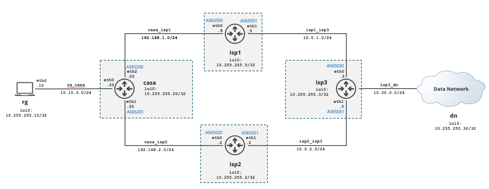

# BGP 4 router example

The project creates 6 containers using the images created in the upper folder and arrange them as per the diagram shown below. The example sets up a network of 4 bgp routers allowing connectivty between the 2 enpoints (rg and dn).



A couple of useful scripts helps creating, deleting and  operating the container cluster. Due to the way the scripts are written only one cluster can be created and maintened per host.

The customize folder keeps all configuration and scripts to automatically start and configure each container. The bird configuration files are kept outside of the containers. This allows to make changes persistent as well as reconfiguring bird without logging into the container.

The container cluster consist of two endpoints called rg (residential gateway) and dn (data network). Both using the same bird image, but essentially don't require a routing engine. Hence bird doesn't get started for neither of them. This can be seen in the init.sh script of each container.
Instead both container get default gateway configured and traceroute installed to verify the traffic path.

Following is a quick explanation of the scripts.
## Command Reference
- [Up](#up)
- [Configure](#configure)
- [Reload](#reload)
- [Show](#show)
- [Connect](#connect)
- [Traceroute](#tracert)
- [Down](#down)

### up 

The following example creates a container cluster and neworks. It configures all containers so that traffic can be sent back and forth between the rg and dn.
```
$ ./up 
Creating network "bird_rg_casa" with driver "bridge"
Creating network "bird_casa_isp1" with driver "bridge"
Creating network "bird_casa_isp2" with driver "bridge"
Creating network "bird_isp1_isp3" with driver "bridge"
Creating network "bird_isp2_isp3" with driver "bridge"
Creating network "bird_isp3_dn" with driver "bridge"
Creating bird_dn_1   ... done
Creating bird_casa_1 ... done
Creating bird_isp1_1 ... done
Creating bird_rg_1   ... done
Creating bird_isp2_1 ... done
Creating bird_isp3_1 ... done
$ 
```
[Back to command reference list](#command-reference)  

### configure
Allows to directly access the bird.conf configuration file of the specified router and allows for permanently changing its configuration. The container name can be one of "casa", "isp1", "isp2" or "isp3".
```
$ ./configure isp1
```
[Back to command reference list](#command-reference)  

### reload
Allows to apply the changes configuration. It allows for the container name (or its short forms as per configure above) or "all" to reload all configurations in one shot. In case of a single container bird config being reloaded, the resulting 'show protocols' will be appended to the output.
```
$ ./reload isp1
BIRD 2.0.9 ready.
Reading configuration from /usr/local/etc/bird.conf
Reconfigured
BIRD 2.0.9 ready.
Name       Proto      Table      State  Since         Info
device1    Device     ---        up     15:22:05.281  
direct1    Direct     ---        up     15:22:05.281  
kernel1    Kernel     master4    up     15:22:05.281  
static1    Static     master4    up     15:22:05.281  
casa       BGP        ---        up     15:22:09.471  Established   
isp3       BGP        ---        up     15:22:09.742  Established   
$
$ ./reload all
BIRD 2.0.9 ready.
Reading configuration from /usr/local/etc/bird.conf
Reconfigured
BIRD 2.0.9 ready.
Reading configuration from /usr/local/etc/bird.conf
Reconfigured
BIRD 2.0.9 ready.
Reading configuration from /usr/local/etc/bird.conf
Reconfigured
BIRD 2.0.9 ready.
Reading configuration from /usr/local/etc/bird.conf
Reconfigured
$
```
[Back to command reference list](#command-reference)  

### show
The show command (issued for a single container/router) shows the output of three show commands:
- show protocols all
- show protocols
- show route
```
$ ./show casa
BIRD 2.0.9 ready.
Name       Proto      Table      State  Since         Info
device1    Device     ---        up     15:22:06.110  

direct1    Direct     ---        up     15:22:06.110  
  Channel ipv4
    State:          UP
    Table:          master4
    Preference:     240
    Input filter:   ACCEPT
    Output filter:  REJECT
    Routes:         3 imported, 0 exported, 3 preferred
    Route change stats:     received   rejected   filtered    ignored   accepted
      Import updates:              3          0          0          0          3
      Import withdraws:            0          0        ---          0          0
      Export updates:              0          0          0        ---          0
      Export withdraws:            0        ---        ---        ---          0

kernel1    Kernel     master4    up     15:22:06.110  
  Channel ipv4
    State:          UP
    Table:          master4
    Preference:     10
    Input filter:   ACCEPT
    Output filter:  ACCEPT
    Routes:         0 imported, 6 exported, 0 preferred
    Route change stats:     received   rejected   filtered    ignored   accepted
      Import updates:              0          0          0          0          0
      Import withdraws:            0          0        ---          0          0
      Export updates:             12          0          0        ---         12
      Export withdraws:            0        ---        ---        ---          0

static1    Static     master4    up     15:22:06.110  
  Channel ipv4
    State:          UP
    Table:          master4
    Preference:     200
    Input filter:   ACCEPT
    Output filter:  REJECT
    Routes:         1 imported, 0 exported, 0 preferred
    Route change stats:     received   rejected   filtered    ignored   accepted
      Import updates:              1          0          0          0          1
      Import withdraws:            0          0        ---          0          0
      Export updates:              0          0          0        ---          0
      Export withdraws:            0        ---        ---        ---          0

isp1       BGP        ---        up     15:22:09.471  Established   
  Description:    BGP uplink ISP1
  BGP state:          Established
    Neighbor address: 192.168.1.5
    Neighbor AS:      65050
    Local AS:         65200
    Neighbor ID:      10.255.255.5
    Local capabilities
      Multiprotocol
        AF announced: ipv4
      Route refresh
      Graceful restart
      4-octet AS numbers
      Enhanced refresh
      Long-lived graceful restart
    Neighbor capabilities
      Multiprotocol
        AF announced: ipv4
      Route refresh
      Graceful restart
      4-octet AS numbers
      Enhanced refresh
      Long-lived graceful restart
    Session:          external AS4
    Source address:   192.168.1.20
    Hold timer:       189.411/240
    Keepalive timer:  41.865/80
  Channel ipv4
    State:          UP
    Table:          master4
    Preference:     100
    Input filter:   (unnamed)
    Output filter:  (unnamed)
    Routes:         4 imported, 5 exported, 1 preferred
    Route change stats:     received   rejected   filtered    ignored   accepted
      Import updates:              4          0          0          0          4
      Import withdraws:            0          0        ---          0          0
      Export updates:              8          3          0        ---          5
      Export withdraws:            0        ---        ---        ---          0
    BGP Next hop:   192.168.1.20

isp2       BGP        ---        up     15:22:10.250  Established   
  Description:    BGP uplink ISP2
  BGP state:          Established
    Neighbor address: 192.168.2.2
    Neighbor AS:      65020
    Local AS:         65201
    Neighbor ID:      10.255.255.2
    Local capabilities
      Multiprotocol
        AF announced: ipv4
      Route refresh
      Graceful restart
      4-octet AS numbers
      Enhanced refresh
      Long-lived graceful restart
    Neighbor capabilities
      Multiprotocol
        AF announced: ipv4
      Route refresh
      Graceful restart
      4-octet AS numbers
      Enhanced refresh
      Long-lived graceful restart
    Session:          external AS4
    Source address:   192.168.2.20
    Hold timer:       162.765/240
    Keepalive timer:  43.808/80
  Channel ipv4
    State:          UP
    Table:          master4
    Preference:     100
    Input filter:   (unnamed)
    Output filter:  (unnamed)
    Routes:         4 imported, 4 exported, 2 preferred
    Route change stats:     received   rejected   filtered    ignored   accepted
      Import updates:              6          0          0          0          6
      Import withdraws:            2          0        ---          0          2
      Export updates:              8          2          0        ---          6
      Export withdraws:            0        ---        ---        ---          2
    BGP Next hop:   192.168.2.20

BIRD 2.0.9 ready.
Name       Proto      Table      State  Since         Info
device1    Device     ---        up     15:22:06.110  
direct1    Direct     ---        up     15:22:06.110  
kernel1    Kernel     master4    up     15:22:06.110  
static1    Static     master4    up     15:22:06.110  
isp1       BGP        ---        up     15:22:09.471  Established   
isp2       BGP        ---        up     15:22:10.250  Established   
BIRD 2.0.9 ready.
Table master4:
10.20.0.0/24         unicast [isp2 15:22:13.253] * (100) [AS65031i]
        via 192.168.2.2 on eth1
                     unicast [isp1 15:22:09.743] (100) [AS65030i]
        via 192.168.1.5 on eth0
10.10.0.0/24         unicast [direct1 15:22:06.112] * (240)
        dev eth2
                     unicast [static1 15:22:06.110] (200)
        dev eth2
192.168.1.0/24       unicast [direct1 15:22:06.112] * (240)
        dev eth0
                     unicast [isp1 15:22:09.740] (100) [AS65050i]
        via 192.168.1.5 on eth0
192.168.2.0/24       unicast [direct1 15:22:06.112] * (240)
        dev eth1
                     unicast [isp2 15:22:13.253] (100) [AS65020i]
        via 192.168.2.2 on eth1
10.0.1.0/24          unicast [isp1 15:22:09.740] * (100) [AS65050i]
        via 192.168.1.5 on eth0
                     unicast [isp2 15:22:13.253] (100) [AS65031i]
        via 192.168.2.2 on eth1
10.0.2.0/24          unicast [isp2 15:22:13.253] * (100) [AS65020i]
        via 192.168.2.2 on eth1
                     unicast [isp1 15:22:09.743] (100) [AS65030i]
        via 192.168.1.5 on eth0
$
```
[Back to command reference list](#command-reference)  

### connect
Allow to ssh directly into the container. The default password "root" is applicable to all containers.
```
$ ./connect rg
Warning: Permanently added '[localhost]:55050' (ECDSA) to the list of known hosts.
root@localhost's password: 
Welcome to Alpine!

The Alpine Wiki contains a large amount of how-to guides and general
information about administrating Alpine systems.
See <http://wiki.alpinelinux.org/>.

You can setup the system with the command: setup-alpine

You may change this message by editing /etc/motd.

00f65e587c96:~# 
```
[Back to command reference list](#command-reference)  

### tracert [rg|dn]
Starts a traceroute on one endpoint to the other, e.g. starting a traceroute on rg destines it to the dn.
```
$ ./tracert rg
traceroute to 10.20.0.30 (10.20.0.30), 30 hops max, 46 byte packets
 1  bird_casa_1.bird_rg_casa (10.10.0.20)  0.010 ms  0.009 ms  0.010 ms
 2  192.168.2.2 (192.168.2.2)  0.007 ms  0.024 ms  0.021 ms
 3  10.0.2.3 (10.0.2.3)  0.013 ms  0.021 ms  0.023 ms
 4  10.20.0.30 (10.20.0.30)  0.022 ms  0.027 ms  0.024 ms
$
$ ./tracert dn
traceroute to 10.10.0.10 (10.10.0.10), 30 hops max, 46 byte packets
 1  bird_isp3_1.bird_isp3_dn (10.20.0.3)  0.009 ms  0.005 ms  0.014 ms
 2  10.0.2.2 (10.0.2.2)  0.005 ms  0.021 ms  0.023 ms
 3  192.168.2.20 (192.168.2.20)  0.023 ms  0.023 ms  0.025 ms
 4  10.10.0.10 (10.10.0.10)  0.022 ms  0.025 ms  0.018 ms
```
[Back to command reference list](#command-reference)  

### down
Stops and removes the cluster and networks.
```
$ ./down
Stopping bird_isp3_1 ... done
Stopping bird_isp2_1 ... done
Stopping bird_rg_1   ... done
Stopping bird_isp1_1 ... done
Stopping bird_casa_1 ... done
Stopping bird_dn_1   ... done
Removing bird_isp3_1 ... done
Removing bird_isp2_1 ... done
Removing bird_rg_1   ... done
Removing bird_isp1_1 ... done
Removing bird_casa_1 ... done
Removing bird_dn_1   ... done
Removing network bird_rg_casa
Removing network bird_casa_isp1
Removing network bird_casa_isp2
Removing network bird_isp1_isp3
Removing network bird_isp2_isp3
Removing network bird_isp3_dn
$
```
[Back to command reference list](#command-reference)  
